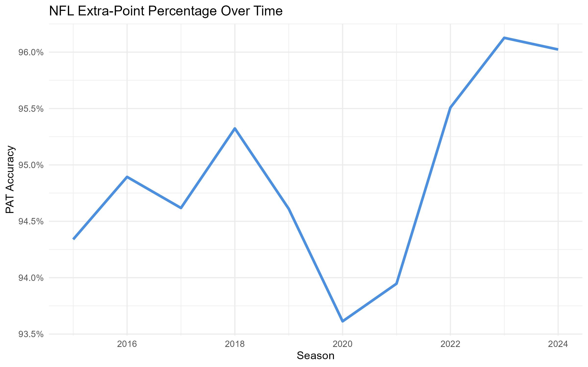
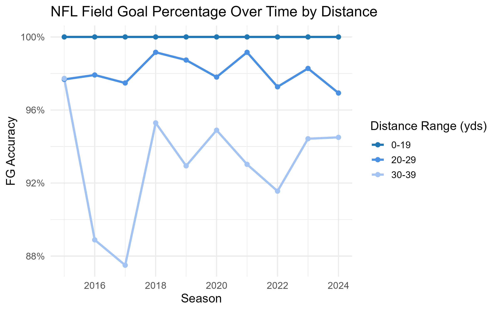

```{r setup, include=FALSE}
knitr::opts_chunk$set(echo = FALSE, message=FALSE, warning=FALSE)
```

```{r}
source("scripts/create_dataset.R")
source("scripts/data_preprocessing.R")

```

# Data Summary

This dataset contains NFL season stats for 3,172 unique players. The players represent all 32 NFL teams. The data spans from 2015 through the most recent full season, 2024. It includes defensive back, defensive linemen, kickers, linebackers, quarterbacks, running backs, tight ends, and wide receivers. Not all stats are applicable to every player, explaining the missing values seen in the data. For example, a quarterback will have missing values for all field goal related stats. Some players may also have missing data if they did not achieve that stat, often explained by minimal playing time. The variables in the dataset are:

Player Information

-   PlayerName : Player First and Last Name
-   PlayerId: Unique Player ID from the fantasy provider
-   Pos: Player Position
-   Team: Player's Team Abbreviation at time of stat
-   Rank: Fantasy rank by position
-   TotalPoints: Total Fantasy points
-   year: Season year

Defensive Stats

-   TacklesTot: Total Combined Tackles
-   TacklesAst: Assisted Tackles
-   TacklesSck: Sacks
-   TacklesTfl: Tackles for Loss
-   TurnoverInt: Interception
-   TurnoverFrcFum: Forced Fumbles
-   TurnoverFumRec: Fumble Recoveries
-   ScoreIntTd: Interception Returned for a TD (Pick-6)
-   ScoreFumTd: Fumble Returned for a TD
-   ScoreBlkTd: Blcoked punt/FG Returned for a TD
-   ScoreSaf: Safety Scored by the Defense
-   ScoreDef2ptRet: Defensive 2 Point Conversion Returned for a TD
-   Blk: Blocked kick (FG/PAT/Punt)
-   PDef: Passes Defended
-   QBHit: Quarterback Hits
-   ReturnIntYds: Interception Return Yards
-   ReturnFumYds: Fumble Return Yards

Kicker Stats

-   PatMade: PATs (extra points) made
-   PatMissed: PATs missed
-   FgMade_0-19: Field goals made from 0-19 yards
-   FgMade_20-29: Field goals made from 20-29 yards
-   FgMade_30-39: Field goals made from 30-39 yards
-   FgMade_40-49: Field goals made from 40-49 yards
-   FgMade_50: Field goals made from 50+ yards
-   FgMiss_0-19: Field goals missed from 0-19 yards
-   FgMiss_20-29: Field goals missed from 20-29 yards
-   FgMiss_30-39: Field goals missed from 30-39 yards

Quarterback Stats:

-   PassingYDS: Passing yards
-   PassingTD: Passing touchdowns
-   PassingInt: Interceptions Thrown

Offensive Stats

-   RushingYDS: Rushing yards

-   RushingTD: Rushing touchdowns

-   ReceivingRec: Receptions

-   ReceivingYDS: Receiving yards

-   ReceivingTD: Receiving touchdowns

-   RetTD: Kick/Punt return touchdowns

-   FumTD: Offensive Fumble recovery TD

-   2PT: 2 point conversions

-   Fum: Fumbles

-   FanPtsAgainst-pts: Fantasy Points allowed by the player's defense

-   TouchCarries: Carries contributing to total touches

-   TouchReceptions: Receptions contributing to total touches

-   Touches: Total opportunities (carries+receptions)

-   TargetsReceptions:

-   Targets:

-   ReceptionPercentage: Receptions/Targets

-   RzTarget: Red Zone targets

-   RzTouch: Red Zone touches

-   RzG2G: Red Zone goal-to-go touches (inside the 10)

# Data Pre-Processing

The team value "FA" which refers to free agents was removed for analysis, so only players on a team during the season were included. The team values "LA" and "LAR" were combined. LA was used to refer to the Rams until 2023 and then LAR was used in 2023 and 2024. Now, all seasons of the LA Rams are coded as "LAR". Data from the 2025 season was removed as it is incomplete due to the season being in progress.

# Kicker Stats

```{r}
source("scripts/PAT.R")

```

Extra-point percentage in the NFL has increased over time, which is expected as the sport gets more competitive and training becomes more intense. There was a dip in 2020, potentially explained by the COVID-19 pandemic. Some players opted out of the 2020 season and most stadiums did not allow fans or did with limited capacity. The different conditions may have impacted kicker's accuracy, but the drop is only about 2 percentage points so may not represent a meaningful difference that season.

```{r}
source("scripts/FG.R")

```

NFL kicker's consistently made 100% of field goals from 0-19 yards over time. From 20-29 yards, the percentage fluctuates around 98% accuracy. We see much greater variability in accuracy from 30-39 yards, dropping as low as about 88% in 2017. These trajectories make sense because the greater the distance, the harder it is to make a field goal.
