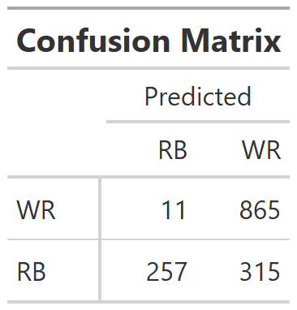

```{r setup, include=FALSE}
knitr::opts_chunk$set(echo = FALSE, message=FALSE, warning=FALSE)
```

```{r}
source("scripts/create_dataset.R")
source("scripts/data_preprocessing.R")

```

# Data Summary

This dataset contains NFL season stats and fantasy football data for 3,172 unique players. The players represent all 32 NFL teams. The data spans from 2015 through the most recent full season, 2024. It includes defensive backs, defensive linemen, kickers, linebackers, quarterbacks, running backs, tight ends, and wide receivers. Not all statistics are applicable to every player, explaining the bulk of the missing values seen in the data. For example, a quarterback will have missing values for all field goal related stats. Some players may also have missing data if they did not achieve that stat, often explained by minimal playing time. The variables in the dataset are:

*Player Information*

-   PlayerName: Player first and last name
-   PlayerId: Unique player ID
-   Pos: Player position
-   Team: Player's team abbreviation at the time of  the stat
-   Rank: Fantasy rank by position per season
-   TotalPoints: Total fantasy points
-   year: Season year

*Defensive Stats*
Includes total tackles, assisted tackles, sacks, tackles for loss, interceptions, forced fumbles, fumble recoveries, defensive touchdowns, blocked kicks, passes defended, quarterback hits, interception and fumble return yards, and other defensive scoring events.

*Kicker Stats*

Includes extra points made/missed and field goals made/missed by distance ranges (0–19, 20–29, 30–39, 40–49, 50+ yards).

*Quarterback Stats*

Includes passing yards, passing touchdowns, and interceptions thrown.

*Offensive Stats*

Includes rushing yards and touchdowns, receptions, receiving yards and touchdowns, total touches, targets, red-zone touches, fumbles, two-point conversions, and fantasy points allowed (for defensive scoring).

# Data Pre-Processing

The team value "FA" which refers to free agents was removed for analysis, so only players on a team during the season were included. The team values "LA" and "LAR" were combined. LA was used to refer to the Rams until 2023 and then LAR was used in 2023 and 2024. Now, all seasons of the LA Rams are coded as "LAR". Data from the 2025 season was removed as it is incomplete due to the season being in progress.

# Exploratory Analysis

## Kicker Performance

```{r}
source("scripts/PAT.R")
knitr::include_graphics("figures/PAT_Percentage.png")
```

Extra-point accuracy in the NFL has generally increased over time, reflecting improved training and competition. There was a slight dip in 2020, likely explained by the COVID-19 pandemic. Some players opted out of the 2020 season and most stadiums did not allow fans or did with limited capacity. The different conditions may have impacted kicker's accuracy, but the drop is only about 2 percentage points so may not represent a meaningful difference that season.

```{r}
source("scripts/FG.R")
knitr::include_graphics("figures/FG_Percentage.png")
```

Field goal accuracy shows expected patterns. NFL kicker's consistently made 100% of field goals from 0-19 yards over time. From 20-29 yards, the percentage fluctuates around 98% accuracy. We see much greater variability in accuracy from 30-39 yards, dropping as low as about 88% in 2017, highlighting the difficulty of longer kicks. 

# Classification Model for Offensive Players

The goal of this next analysis was to classify offensive NFL skill players as wide receivers (WR) or Running Backs (RB) based on rushing, receiving, and red-zone statistics.

Variables considered for the model: RushingYDS, RushingTD, TouchCarries, ReceivingRec, ReceivingYDS, ReceivingTD, Targets, ReceptionPercentage, TouchReceptions, RzTarget, RzTouch, RzG2G, Fum, FumTD

The data was split into training (70%) and test sets (30%). A logistic regression model was fit to the training data. Stepwise selection based on AIC was used to identify the most informative predictors. Variables were added or removed based on whether they improved model AIC. The final model included RushingTD, TouchCarries, ReceivingRec, ReceivingYDS, Targets, TouchReceptions, RzTouch, and Fum. 

```{r, results='hide'}
source("scripts/offense_classification.R")
```

```{r}

```

The model correctly classified the majority of players. It performed better at identifying WRs, misclassifying 1% of actual WRs, while 55% of actual RBs were misclassified. The overall accuracy was 78%.

```{r}
knitr::include_graphics("figures/ROC.png")
```

The ROC curve illustrates the trade-off between sensitivity and specificity. The area under the curve is 0.834, which indicates solid classification performance.

Touch carries and targets were the most informative features for distinguishing RBs from WRs. RBs typically have more carries and rushing touchdowns while WRs have higher targets, receiving yards, and receptions.

# Conclusions and Future Directions

Logistic regression effectively distinguished WRs from RBs but misclassification of RBs indicates additional predictive features may be needed. 

Future analyses could include: multi-class classification for WR vs RB vs TE, predicting fantasy points or fantasy rank, or including defensive and kicker stats for broader performance modeling. 
