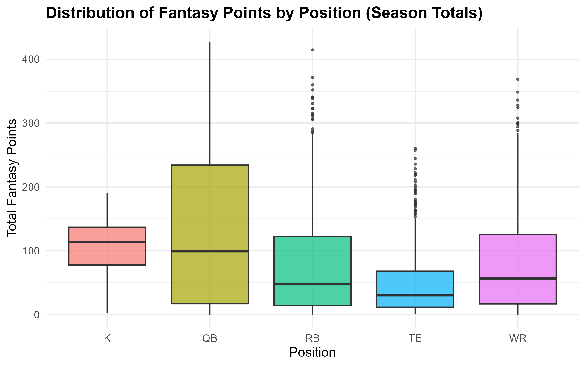
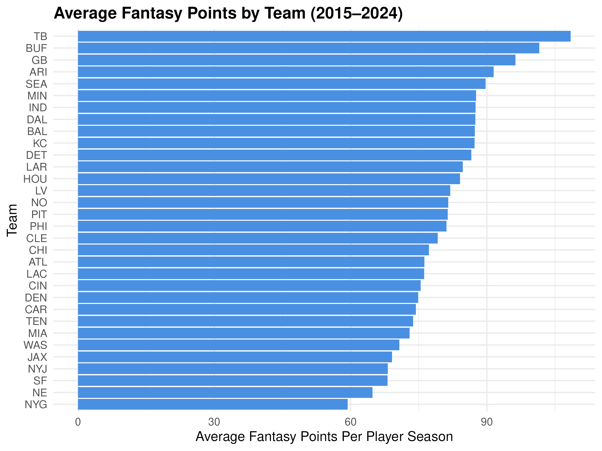
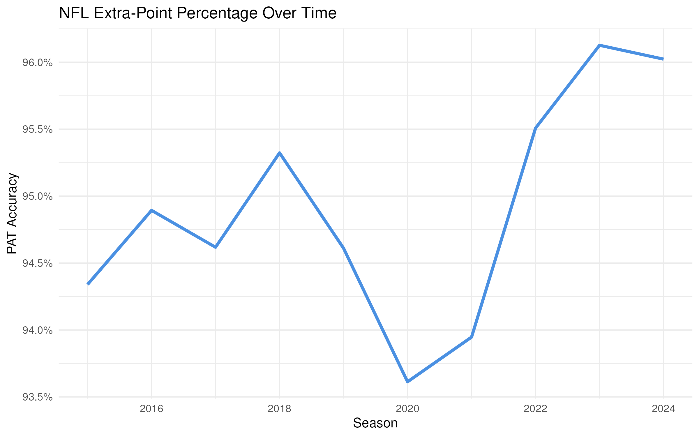
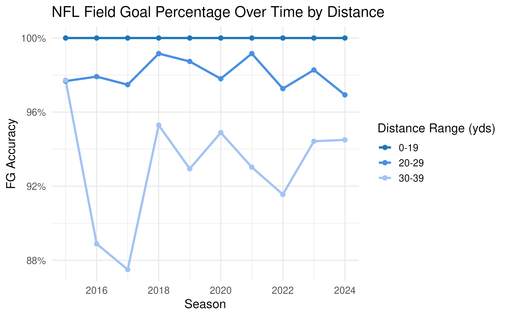
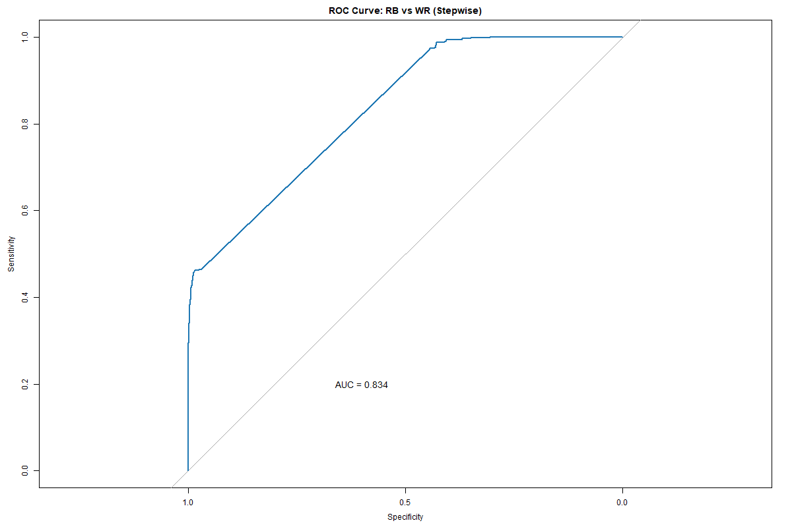

```{r setup, include=FALSE}
knitr::opts_chunk$set(echo = FALSE, message=FALSE, warning=FALSE)
```

```{r create and filter data}
source("scripts/create_dataset.R")
source("scripts/data_preprocessing.R")
```

# Data Summary

This dataset contains NFL season stats and fantasy football data for 3,172 unique players. The players represent all 32 NFL teams. The data spans from 2015 through the most recent full season, 2024. It includes defensive backs, defensive linemen, kickers, linebackers, quarterbacks, running backs, tight ends, and wide receivers. Not all statistics are applicable to every player, explaining the bulk of the missing values seen in the data. For example, a quarterback will have missing values for all field goal related stats. Some players may also have missing data if they did not achieve that stat, often explained by minimal playing time. The variables in the dataset are:

#### Player Information

-   PlayerName: Player first and last name
-   PlayerId: Unique player ID
-   Pos: Player position
-   Team: Player's team abbreviation at the time of the stat
-   Rank: Fantasy rank by position per season
-   TotalPoints: Total fantasy points
-   year: Season year

#### Kicker Stats

Includes extra points made/missed and field goals made/missed by distance ranges (0–19, 20–29, 30–39, 40–49, 50+ yards).

#### Quarterback Stats

Includes passing yards, passing touchdowns, and interceptions thrown.

#### Offensive Stats

Includes rushing yards and touchdowns, receptions, receiving yards and touchdowns, total touches, targets, red-zone touches, fumbles, two-point conversions, and fantasy points allowed (for defensive scoring).

*Note this dataset is different from the one I submitted earlier in the semester. I was able to find a more comprehensive dataset. 

# Data Pre-Processing

Defensive positions (LB, DL, DB) were removed because most fantasy leagues don't use individual defensive player scoring systems, they usually focus on offensive players and a defense as a whole. Corresponding defensive stats were removed as well. 

The team value "FA" which refers to free agents was removed for analysis, so only players on a team during the season were included. The team values "LA" and "LAR" were combined. LA was used to refer to the Rams until 2023 and then LAR was used in 2023 and 2024. Now, all seasons of the LA Rams are coded as "LAR". 

Data from the 2025 season was removed as it is incomplete due to the season being in progress. Players with 0 fantasy points were also excluded since they likely did not play meaningful snaps and would artificially compress the lower end of the distribution.

# Exploratory Analysis

## Fantasy Points by Position

To begin exploring the dataset, I examined the distribution of fantasy points by position. Because this dataset spans 10 seasons (2015-2024), some players appear multiple times, but each observation represents one complete season of performance.

```{r points by position}
source("scripts/points_position.R")

```

From the boxplot, quarterbacks show the highest variability in fantasy points. This aligns with how fantasy scoring works: quarterbacks accumulate points through passing, rushing, and touchdowns, and elite QBs can produce substantially more than replacements. Running backs also display considerable spread, reflecting the difference between high-volume starters, situational players, and backups.

Kickers appear much more consistent across seasons, with a relatively narrow distribution of fantasy points. This likely reflects stable playing time. Most teams use only one kicker per season, whereas offensive and defensive skill positions often rotate due to injuries or depth chart changes.

These distributions give some insight into fantasy team strategy. Positions like quarterback and running back show high ceilings but also high variance, making elite players particularly valuable early in drafts. In contrast, positions such as kicker tend to have lower and more predictable scoring, making them less critical to address early in a draft.

## Average Fantasy Points by Team

To explore how offensive environments differ across NFL franchises, I calculated the average fantasy points per offensive player-season for each team from 2015 through 2024. Each observation represents a single player's total fantasy points for one season; therefore, teams appear multiple times per year corresponding to the number of offensive players who recorded at least one fantasy point.

Each team contributed roughly 100–150 offensive player-seasons across the 10-year span, which aligns with expectations based on typical roster structures and yearly personnel turnover. This consistency indicates that the dataset was cleaned successfully and supports valid team-to-team comparisons.

```{r points by team}
source("scripts/points_team.R")

```

Average player-season totals vary widely between teams. Tampa Bay, Buffalo, and Green Bay rank at the top, with averages above 95 points, reflecting stable quarterbacks, high-volume skill players, and consistent offensive schemes. In contrast, teams such as New York (both the Giants and Jets), New England, and San Francisco rank near the bottom, with averages below 70 points per player-season. These lower averages often result from a combination of lower offensive output and concentrated usage, where a small number of players account for most fantasy points while depth players contribute minimally.

Overall, this analysis demonstrates that both team offensive quality and the distribution of touches strongly influence fantasy production. Teams with high-volume, well-rounded offenses tend to elevate the scoring potential of all offensive players, while concentrated or inconsistent offenses show lower average output across the roster.

## Kicker Performance

Next, I looked at how kickers have evolved in the NFL since 2015 by evaluating their extra-point accuracy over time. 

```{r kicker PAT}
source("scripts/PAT.R")

```

Extra-point accuracy has generally increased over time, reflecting improved training and competition. There was a slight dip in 2020, potentially explained by the COVID-19 pandemic. Some players opted out of the 2020 season and most stadiums did not allow fans or did with limited capacity. The different conditions may have impacted kicker's accuracy, but the drop is only about 2 percentage points so may not represent a meaningful difference that season.

I also looked at kicker's field goal accuracy over time aross distances. 
```{r kicker FG}
source("scripts/FG.R")

```

Field goal accuracy shows expected patterns. NFL kicker's consistently made 100% of field goals from 0-19 yards since 2015. From 20-29 yards, the percentage fluctuates around 98% accuracy. We see much greater variability in accuracy from 30-39 yards, dropping as low as about 88% in 2017, highlighting the difficulty of longer kicks.

# Classification Model for Offensive Players

The goal of this next analysis was to classify offensive NFL skill players as wide receivers (WR) or Running Backs (RB) based on rushing, receiving, and red-zone statistics.

Variables considered for the model: RushingYDS, RushingTD, TouchCarries, ReceivingRec, ReceivingYDS, ReceivingTD, Targets, ReceptionPercentage, TouchReceptions, RzTarget, RzTouch, RzG2G, Fum, FumTD

The data was split into training (70%) and test sets (30%). A logistic regression model was fit to the training data. Stepwise selection based on AIC was used to identify the most informative predictors. Variables were added or removed based on whether they improved model AIC. The final model included RushingTD, TouchCarries, ReceivingRec, ReceivingYDS, Targets, TouchReceptions, RzTouch, and Fum.

```{r offense classification, results='hide'}
source("scripts/offense_classification.R")
```

```{r confusion matrix}
conf_gt
```

The model correctly classified the majority of players. It performed better at identifying WRs, misclassifying 1% of actual WRs, while 55% of actual RBs were misclassified. The overall accuracy was 78%.

```{r ROC}

```

The ROC curve illustrates the trade-off between sensitivity and specificity. The area under the curve is 0.834, which indicates solid classification performance.

Touch carries and targets were the most informative features for distinguishing RBs from WRs. RBs typically have more carries and rushing touchdowns while WRs have higher targets, receiving yards, and receptions.

# Clustering for Player Archetypes

To further explore offensive player roles in the NFL and identify archetypes based on usage patterns, I applied k-means clustering to running backs (RB), wide receivers (WR), and tight ends (TE). The features used for clustering capture both rushing and receiving contributions, red-zone involvement, and turnover metrics:

Rushing: Yards, touchdowns, total carries

Receiving: Receptions, yards, touchdowns, targets, reception percentage

Red-zone usage: Targets, touches, goal-to-go (RzG2G) opportunities

Miscellaneous: Fumbles and fumble touchdowns

All numeric features were standardized prior to clustering to account for differences in scale.

I selected 4 clusters to balance interpretability with granularity, capturing distinct usage patterns among skill-position players. The resulting cluster centroids reveal clear archetypes:

```{r clustering}
source("scripts/clustering.R")
```

```{r cluster plot}
cluster_plot
```


```{r cluster summary}
kable(cluster_summary, digits = 2, caption = "Average Stats by Offensive Player Cluster")
```

#### Cluster 1: Workhorse Running Backs
Players in this cluster exhibit high rushing yards, touchdowns, and touch volume, as well as significant red-zone involvement. Some receiving contribution is present, but rushing dominates. These are typically the feature RBs on their team who handle a heavy workload.

#### Cluster 2:  Depth/Low-Usage Players 
Players in this cluster are below average across all features, indicating minimal involvement in either rushing or receiving. These are typically backups, rotational players, or situational contributors.

#### Cluster 3: Situational or Medium-Usage Players 
Cluster 3 players have near-average or slightly above-average receiving metrics but minimal rushing involvement and low red-zone usage. These are likely role players, backups, or situational specialists.

#### Cluster 4: Pass-Catching Wide Receivers and Tight Ends 
Players in Cluster 4 are characterized by high receptions, receiving yards, touchdowns, and targets. Red-zone target involvement is above average, while rushing contribution is minimal. These are the primary passing-game weapons for their teams.

The clustering results align closely with expected positional roles. RBs split naturally into high-usage (Cluster 1) and situational/moderate-usage (Cluster 3) players. WRs and TEs primarily fall into Cluster 4, reflecting their receiving-focused roles. Cluster 2 captures depth players and situational contributors across positions. These archetypes provide a useful framework for fantasy football strategy, allowing identification of players with consistent high-volume usage versus those with specialized or limited roles.

# Conclusions and Future Directions

This analysis provides a comprehensive view of NFL offensive player performance and fantasy football scoring over the 2015–2024 seasons. Key findings include:

1.  Data Characteristics and Positional Patterns: The dataset spans all skill positions, kickers, and quarterbacks, revealing expected patterns of fantasy production. Quarterbacks demonstrate the highest variance in fantasy points due to their ability to accumulate yards and touchdowns through both passing and rushing. Running backs show substantial spread in fantasy production, reflecting the distinction between feature backs, rotational players, and situational specialists. Kickers exhibit relatively consistent scoring, highlighting the stability of their role.

2.  Team-Level Insights: Average fantasy points per offensive player vary substantially across teams. Franchises like Tampa Bay, Buffalo, and Green Bay consistently produce high fantasy output per player, reflecting balanced offenses and stable starting lineups. In contrast, teams such as New York, New England, and San Francisco display lower average output, often due to concentrated scoring among a few elite players and limited depth.

3.  Classification of Skill Players: Logistic regression successfully differentiated wide receivers from running backs, achieving 78% overall accuracy with an AUC of 0.834. The most informative predictors were touch carries and targets, highlighting the fundamental distinction between rushing-dominant RBs and receiving-focused WRs. However, the model struggled to correctly classify a substantial portion of RBs, indicating the potential benefit of incorporating additional features, such as snap counts, offensive scheme context, or red-zone touches.

4.  Clustering and Player Archetypes: K-means clustering of offensive skill players revealed five distinct archetypes:

- Workhorse RBs with high rushing volume and red-zone involvement. 
- Depth or low-usage players with minimal involvement across all metrics. 
- Situational or medium-usage players with limited touches, primarily involved in specific roles. 
- Pass-catching WRs and TEs with high receptions, yards, and red-zone target involvement. 

These clusters align closely with expected positional roles, providing a meaningful framework for evaluating player usage, projecting fantasy performance, and identifying consistent contributors versus situational specialists.

### Future Directions 
1.  Enhanced Classification Models:
- Expand logistic regression to multi-class classification for RB, WR, and TE, capturing more nuanced distinctions. 
- Incorporate additional features such as snap counts, team offensive scheme, and injury history to improve RB classification accuracy.  

2.  Fantasy Point Prediction:
- Develop regression models to predict total fantasy points or weekly scoring for players based on cluster membership, historical trends, and team context. 
- Consider interaction effects between player usage, offensive environment, and position to capture complex scoring dynamics. 

3.  Temporal Analysis and Trend Identification:
- Examine changes in player archetypes over time to identify evolving trends in offensive strategy, such as increased emphasis on pass-catching backs or receiving-focused TEs. 
- Investigate the stability of cluster membership across seasons to assess consistency of player roles and fantasy value.

This study demonstrates the utility of combining exploratory analysis, classification modeling, and clustering to understand NFL offensive player roles and fantasy football production. Clustering provides actionable archetypes for assessing player usage, while logistic regression highlights the importance of touches and targets in distinguishing positional roles. Future work can build on these foundations to create predictive models, multi-class classification systems, and decision support tools for fantasy football strategy and player evaluation.
